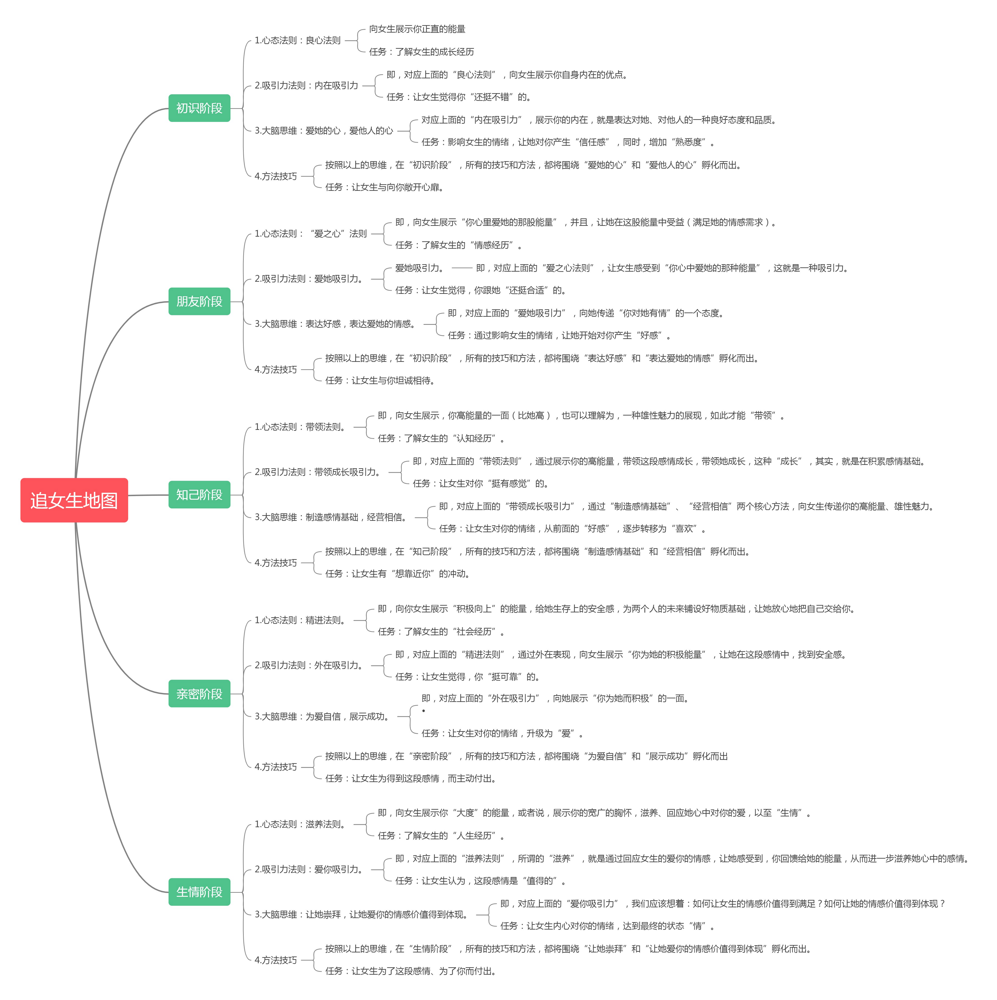

# Five Stages of Relationship Development (追女生地图)

**Source:** Jun Ge (君哥)
**Date Added:** 2026-03-11

---

## Stage 1: Initial Stage (初识阶段)

| Dimension | Detail |
|---|---|
| **Mindset Rule** | Goodwill Rule — show sincere energy |
| **Task** | Understand her growth experience |
| **Attraction Method** | Inner Attraction — show your internal strengths |
| **Goal** | Make her feel "not bad" about you |
| **Big Picture** | Love her heart, care for others — show positive attitude and quality |
| **Emotional Target** | Build **trust** and increase familiarity |
| **Skill Focus** | Make her open her heart to you |

## Stage 2: Friend Stage (朋友阶段)

| Dimension | Detail |
|---|---|
| **Mindset Rule** | Love Heart Rule — satisfy her emotional needs |
| **Task** | Understand her emotional experiences |
| **Attraction Method** | Love Attraction — let her feel your heart's energy |
| **Goal** | Make her feel "you are suitable for her" |
| **Big Picture** | Express affection — convey your caring attitude |
| **Emotional Target** | Develop **good feelings** toward you |
| **Skill Focus** | Make her willingly accompany you |

## Stage 3: Knowledge Stage (知己阶段)

| Dimension | Detail |
|---|---|
| **Mindset Rule** | Leading Rule — show leadership energy |
| **Task** | Understand her recognition experience |
| **Attraction Method** | Leading Growth Attraction — help her emotional growth |
| **Goal** | Make her feel **admiration** |
| **Big Picture** | Create emotional foundation, manage beliefs — show competence and masculinity |
| **Emotional Target** | Transform "good feelings" into **liking** |
| **Skill Focus** | Make her want to get closer to you |

## Stage 4: Intimacy Stage (亲密阶段)

| Dimension | Detail |
|---|---|
| **Mindset Rule** | Subtle Rule — create safety and security |
| **Task** | Understand her social experiences |
| **Attraction Method** | External Attraction — give her security in the interaction |
| **Goal** | Make her feel **reliable** |
| **Big Picture** | Show confidence, demonstrate success |
| **Emotional Target** | Elevate emotions to **love** |
| **Skill Focus** | Let her actively engage and reciprocate |

## Stage 5: Life Stage (生情阶段)

| Dimension | Detail |
|---|---|
| **Mindset Rule** | Nourishing Rule — fulfill her emotional needs with great love |
| **Task** | Understand her life experiences |
| **Attraction Method** | Love Attraction — nourish her emotions |
| **Goal** | Make her see the love as **valuable** |
| **Big Picture** | Let her feel the value of your love |
| **Emotional Target** | Achieve **attachment** |
| **Skill Focus** | Let her fight for the emotional bond and give back |
