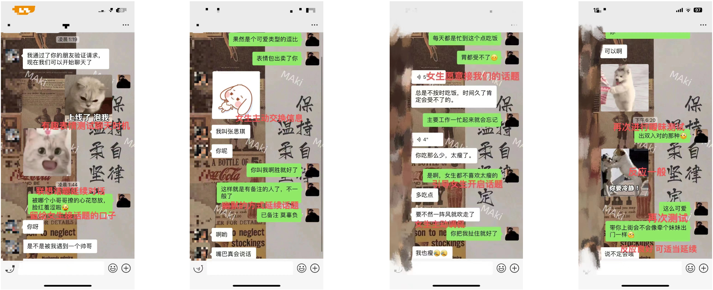

# Step 1: Icebreaking & Testing

**Source:** Jun Ge (君哥) — Five-Step Chatting Method
**Date Added:** 2026-03-11

---

## Concept

The first step is to move past the stranger stage smoothly. Relationships progress through five stages:

1. **Stranger** (you are here)
2. Friend
3. Getting-to-know-each-other
4. Flirting / Ambiguous
5. Intimate relationship

---

## Icebreaking Strategy

**Purpose:** Get past the stranger stage and create a comfortable, engaging atmosphere.

### Don't
- Start with rigid openers ("What's your name?", "What are you doing?")
- Jump straight into cheesy pickup lines or flirtation

### Do
- Use a simple, fun emoji or sticker as an opener
- Test if she has time to chat and gauge interest
- Guide the conversation without forcing it

**Principle:** Topics are tools, not the goal. The real aim is to engage her emotions and set a high-EQ conversational tone.

---

## Light Persona & Flirtation Testing

After initial icebreaking:
1. Introduce your persona subtly (show you're interesting and fun)
2. Test if she can accept light flirtation

**If she ignores the flirt** → brake and shift topic, don't force. Try again later from a new angle.

---

## Reading Responses

| Response Type | What It Means |
|---|---|
| Emojis, "haha", neutral replies | **Neutral** — not interest, not rejection |
| Questions or hypothetical replies | **Genuine interest** — she's engaging |

Example of interest: "Then what would you take me to eat?" → she's playing along.

---

## Signs of Successful Icebreaking

- She actively participates and picks up your topics
- Atmosphere feels natural, like you've been talking for a while
- She's willing to continue the conversation

---

## Sample Lines

| Situation | Example | Purpose |
|---|---|---|
| Fun opener | Playful emoji/sticker | Test if she has time/interest |
| Responding to shy emoji | "Whose little heart is blooming with happiness now?" | Tease & guide topic continuation |
| Light flirty test | "If we cuddle together, it'll be fine" | Test acceptance of mild flirtation |
| Neutral reaction | Brake & shift topic → try later | Avoid awkward silence |
| Subtle flirting | "So cute — if I take you out, would it feel like taking a little sister out?" | Introduce flirty vibe safely |

---

## Key Rules

1. Guide the conversation, don't force it
2. Test reactions before introducing flirtation
3. Use topics to engage emotion, not just exchange information
4. Recognize neutral vs. interested responses
5. Icebreaking succeeds when she actively interacts and picks up your topics

