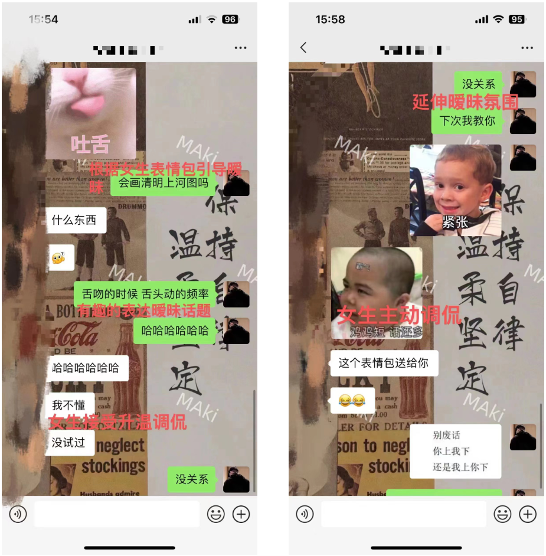

# Step 4: Guiding Flirtation / Ambiguity

**Source:** Jun Ge (君哥) — Five-Step Chatting Method
**Date Added:** 2026-03-11

---

## Concept

**Goal:** Transition from friendship to flirty/ambiguous interaction naturally.

**Common problems:**
- Chatting for months without advancing beyond friendship
- Jumping straight into flirty topics → gets rejected
- Never introducing flirty topics → no chance to escalate

**Solution:** Lay groundwork and guide the conversation gradually — make flirtation feel playful, fun, and natural.

---

## Four Key Principles

### 1. Find a Breakthrough in Her Replies
- Do NOT force flirty topics yourself
- Let flirtation emerge from **her** words, emojis, or behavior
- Example: she sends a tongue emoji → use it as a subtle opening

### 2. Use Subtle and Recoverable Flirtation
- Lines must be playful, not aggressive, and **easy to pull back**
- Link a risque idea to humor → turns it into a joke rather than something overt
- If she doesn't pick up: pull back naturally ("Oh, it's just a TikTok joke I saw, thought it was funny")

### 3. Step-by-Step Escalation
- Only extend flirty topics **after she shows acceptance**
- Keep interactions playful, teasing, and reciprocal
- Avoid impulsive reactions that could cause discomfort

### 4. Mutual Interaction Is Key
- Flirtation works when it's **give-and-take**, not a monologue
- Guide her gradually into playful exchanges so her emotions are involved
- Tease her back lightly when she says something suggestive → creates engagement

---

## Practical Examples

| Step | Example | Purpose |
|---|---|---|
| Subtle opening | Girl sends tongue emoji → "Can you draw the Qingming Riverside painting?" | Curiosity, humor, playful opening |
| Recoverable line | "The tongue movements while kissing can paint a masterpiece, intense!" | Risque joke disguised as humor, easy to retreat |
| Stepwise escalation | "Next time I'll teach you" | Tests flirty waters after acceptance |
| Playful pushback | She says something suggestive → "You can't handle it" | Emotional engagement and teasing |

---

## Recognizing Escalation Signals

*(Added 2026-03-17 from Sean + model case study)*

When the girl **proactively** brings up emotional/relationship topics and inserts herself into future scenarios, that's the green light to escalate.

**Example signal:** Girl asks "以后遇到我这种女生，你是嘴疼还是心疼？" (If you meet a girl like me, would you just talk sweet or genuinely care?) — she's already projecting herself into the girlfriend role.

**What to do:** Advance into ambiguous/couple topics immediately. Do NOT retreat into safe random topics when she's giving you this opening.

**What NOT to do:** Girl gives you a romantic opening and you respond with third-party chitchat — this kills momentum.

---

## Practical Techniques from Case Studies

*(Added 2026-03-17 from Sean + model case study)*

| Technique | Example | How it works |
|---|---|---|
| **反转 (Reversal/Twist)** | "以后不想遇见你这样的女生——因为现在遇到了" | Unexpected emotional impact through reversal |
| **Future projection** | "回到家看到你模特身材就很知足了" | Makes her mentally place herself in the girlfriend role |
| **Conditional investment** | "女朋友也给花，不过要对我好一点" | Push-pull; she chases qualification instead of you chasing |
| **Smooth deflection** | She says "我还没答应呢" → "见面顺其自然" | Doesn't retreat or get awkward, keeps frame |
| **Daily sharing** | Sending cooking photos as conversation opener | Shows domestic value naturally without bragging |

---

## Key Takeaways

1. Flirtation must be **guided, not forced** — start from what she says, not your agenda
2. Use **subtle, playful, recoverable** lines to avoid rejection
3. Escalate **step-by-step**, only after she shows interest or plays along
4. Mutual reciprocal interaction creates real engagement — not one-sided monologues
5. Manage your reactions — don't get carried away; guide her emotions gradually
6. Recognize escalation signals — when she brings up emotional topics proactively, advance immediately

