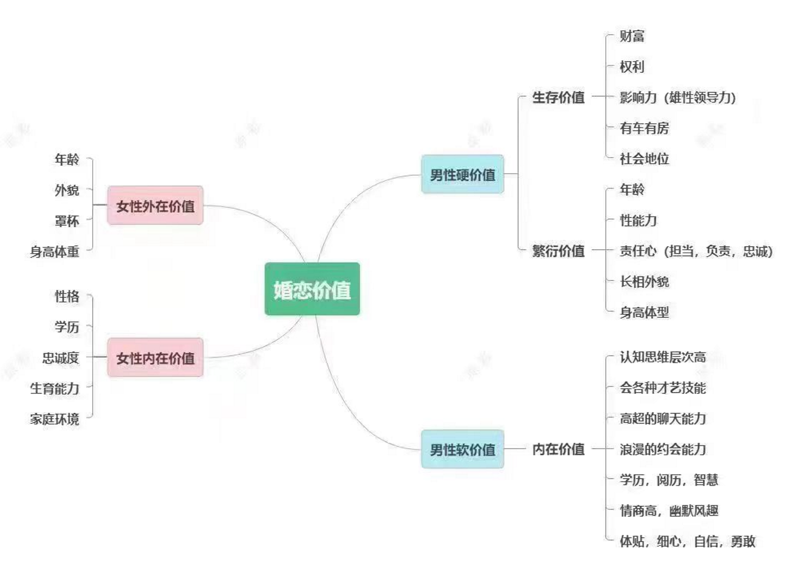

# Marriage & Relationship Value Framework

**Source:** Jun Ge (君哥) — Lesson 1 (Chatting Framework)
**Date Added:** 2026-03-11

---

## Value in Dating and Marriage

Value is divided into **hard value** and **soft value**. Men tend to emphasize women's reproductive value; women emphasize men's survival value and soft value.

---

### Women's External Value
- Age
- Appearance
- Cup size
- Height & weight

### Women's Internal Value
- Personality
- Education
- Loyalty
- Fertility
- Family background

---

### Men's Hard Value

**Survival Value** — what allows you to live well in society:
- Wealth / savings
- Power / authority
- Influence (male leadership)
- Car and house ownership
- Social status

**Reproductive Value** — visible biological traits:
- Age
- Sexual ability
- Sense of responsibility (dependable, accountable, loyal)
- Facial appearance
- Height & body type

### Men's Soft Value (Internal)
- High-level cognition and thinking
- Proficiency in talents and skills (sports, instruments, arts)
- Strong conversational ability
- Romantic dating skills
- Education, knowledge, wisdom
- High emotional intelligence, dark humor
- Considerate, attentive, confident, courageous

---

## Self-Assessment

| Area | Your Rating |
|---|---|
| Height | |
| Weight | |
| Physical appearance | |
| Financial situation (savings) | |
| Conversation skills | |
| Dating skills | |
| Offline communication & expression | |
| Ability to outperform rivals | |
| **Areas currently lacking** | |

---

## Key Insight

> Chatting and pursuing women both involve techniques and methods. Being too eager often backfires — haste makes waste. Unless your personal value is already very high and women are pursuing you, rushing things will cause the conversation to die.
