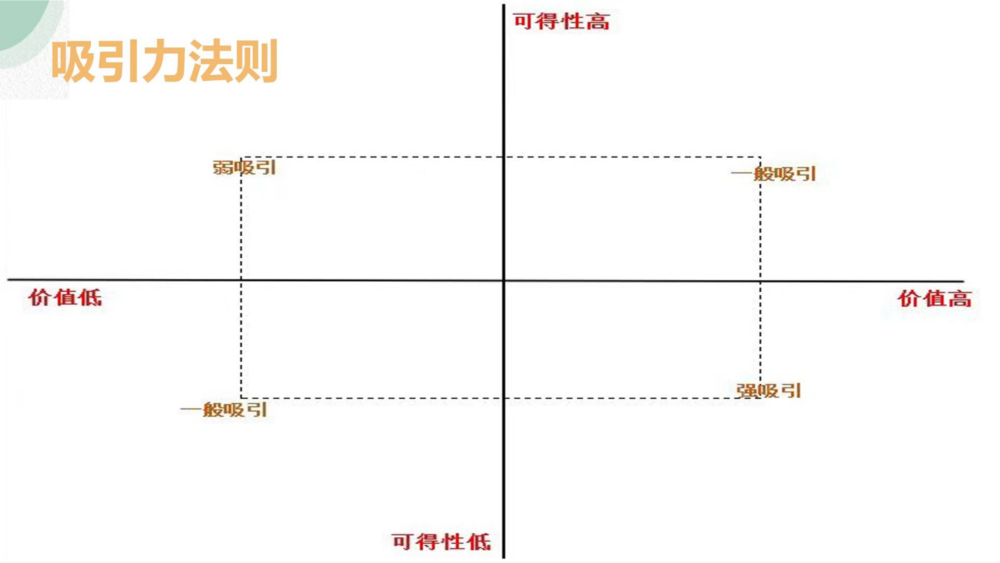

# The Right Mindset About Spending: Invest in Yourself

**Source:** Jun Ge (君哥)
**Date Added:** 2026-03-11

---

## Stop Over-Investing in Women
- Many men spend excessive time, energy, and money on women while neglecting themselves
- Buying gifts, paying for everything, constantly trying to please
- Over-investing makes her more attractive to others while you remain the same

## Invest in Yourself First
- Your learning, time, energy, and money should primarily go toward improving yourself
- Work out, dress well, develop skills, increase emotional intelligence, cultivate interests
- Women are naturally attracted to men who invest in themselves and are high-value

## Self-Investment Creates Genuine Attraction
- If you are stingy or unwilling to spend on yourself, it's impossible for others to genuinely like you
- People mirror the value you place on yourself — if you don't invest in yourself, no one else will
- A high-value man attracts respect, love, and commitment naturally

## Respect Your Resources
- Stop sacrificing your health, finances, or growth for someone who hasn't reciprocated
- Be fair to yourself — spend wisely on yourself first, then share selectively

## Efficient Dating Mindset
- Success in dating isn't about over-investing — it's about strategic, high-value actions
- Maximize results while minimizing wasted effort
- Avoid repeated mistakes and unnecessary loss of resources

---

## Core Message

> Love yourself enough to invest in your own growth. Only then will others invest in you, and you'll attract lasting relationships.

